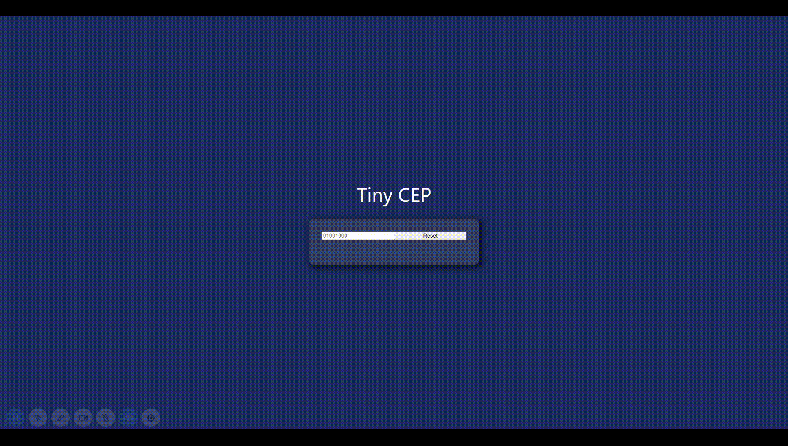

<h1 align="center">Tiny CEP project</h1>

<h2 align="center">About 📖</h2>
   
   <p align="center">
      The Tiny CEP app was developed to establish the theory learned so far in the study of Vue.js     
   </p>

- ✅ "building the application"
- 🔄 "responsiveness"
- 🔄 "complete application"

---

<h2 align="center">Preview 💻📱</h2>

   <p align="center">
      
   </p>

---

<h2 align="center">Functionalities 🛠️</h2>

- get zip code information and display it on the screen

---

<h2 align="center">Technologies 🚀</h2>

- [HTML](https://html.com/)
- [CSS](https://developer.mozilla.org/pt-BR/docs/Web/CSS)
- [JavaScript](https://www.javascript.com/)
- [Vue.js](https://vuejs.org/)

---

<h2 align="center">How to Use 🤔</h2>

<h3 align="center"> Just open de index.html you our browser and try some CEP numbers </h2>

- 25960602 -> [Parque Nacional Serra dos Órgãos](https://www.icmbio.gov.br/parnaserradosorgaos/)
- 25966105 -> [Arabotânica](http://www.arabotanica.com.br/)
- 25990150 -> [Hotel Le Canton](https://lecanton.com.br/)

<p align="center">Discover Teresópolis</p>

---

<h2 align="center">How to Contribute 💪</h2>

```
- Fork the project

- Create a new branch with your changes:
$ git checkout -b my-feature

- Save your changes and create a commit message telling you what you did:
$ git commit -m "feature: My new feature"

- Submit your changes:
$ git push origin my-feature
```

---

<h2 align="center">License 📝</h2>

<p align="center">
   This repository is under MIT license. You can see the <a href="https://github.com/felipecastrosales/Happy/blob/master/LICENSE">LICENSE</a> file for more details. 😉
</p>

---

> This project was developed with ❤️ by **[@Alexandre Lopes](https://www.linkedin.com/in/aleflopes/) <br>
> If it helped you, give it ⭐, it will help me too 😉 The README design was kindly made available by **[@Felipe Sales](https://github.com/felipecastrosales)\*\*

---

   <div align="center">

[](https://www.linkedin.com/in/aleflopes/)

   </div>
